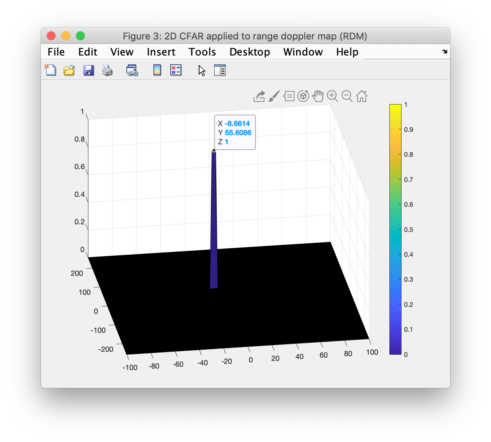

# Radar Target Generation and Detection

This project uses Matlab to introduce frequency modulated continuous-wave (FMCW) radar and related post-processing techniques. The topics covered include:
- Fast Fourier transforms (FFT) and 2D FFT
- Clutter v. target discrimination
- Sizing chirp bandwith to meet system requirements for range resolution
- Phased array beam steering to determine angle of arrival (AoA)
- Constant false alarm rate (CFAR) noise suppression
- Signal-to-noise ratio (SNR) and dynamic thresholding

## Visualization of the results




## Installing Matlab
Instructions for installing the latest version of Matlab can be found at https://www.mathworks.com/

## Project writeup

### Implementation steps for the 2D CFAR process
_See Lines 131-198 in script Radar_Target_Generation_and_Detection.m_

The 2D constant false alarm rate (CFAR), when applied to the results of the 2D FFT, uses a dynamic threshold set by the noise level in the vicinity of the cell under test (CUT). The key steps are as follows:
1. Loop over all cells in the range and doppler dimensions, starting and ending at indices which leave appropriate margins
2. Slice the training cells (and exclude the guard cells) surrounding the CUT
3. Convert the training cell values from decibels (dB) to power, to linearize
4. Find the mean noise level among the training cells
5. Convert this average value back from power to dB
6. Add the offset (in dB) to set the dynamic threshold
7. Apply the threshold and store the result in a binary array of the same dimensions as the range doppler map (RDM).

```
for range_index = Tr + Gr + 1 : Nr/2 - Tr - Gr
    for doppler_index = Td + Gd + 1 : Nd - Td - Gd
        
        % ...
        % ... calculate threshold for this CUT
        % ...
        
        if RDM(range_index, doppler_index) > threshold
            CFAR(range_index, doppler_index) = 1;
        end
    end
end
```
There is potential room for performance improvement though parallelization. These sliding window type operations may be expressed as a convolution.

### Selection of training cells, guard cells, and offset
_Lines 135-149 in script Radar_Target_Generation_and_Detection.m_

The values below were hand selected. I chose a rectangular window with the major dimension along the range cells. This produced better filtered results from the given RDM. Choosing the right value for `offset` was key to isolating the simulated target and avoiding false positives. Finally, I precalculated the `N_training` value to avoid a performance hit in the nested loop.
```
% Select the number of training cells in both the dimensions.
Tr = 12;  % Training (range dimension)
Td = 3;  % Training cells (doppler dimension)

% Select the number of guard cells in both dimensions around the Cell Under 
% Test (CUT) for accurate estimation.
Gr = 4;  % Guard cells (range dimension)
Gd = 1;  % Guard cells (doppler dimension)

% Offset the threshold by SNR value in dB
offset = 15;

% Calculate the total number of training and guard cells
N_guard = (2 * Gr + 1) * (2 * Gd + 1) - 1;  % Remove CUT
N_training = (2 * Tr + 2 * Gr + 1) * (2 * Td + 2 * Gd + 1) - (N_guard + 1);
```

### Steps taken to suppress the non-thresholded cells at the edges
_Line 164 in script Radar_Target_Generation_and_Detection.m_

```
CFAR = zeros(size(RDM));
```
In my 2D CFAR implementation, only CUT locations with sufficient margins to contain the entire window are considered. I start with an empty array of zeros, equivalent in size to the `RDM` array. I then set the indexed locations to one if and only if the threshold is exceeded by the CUT.
